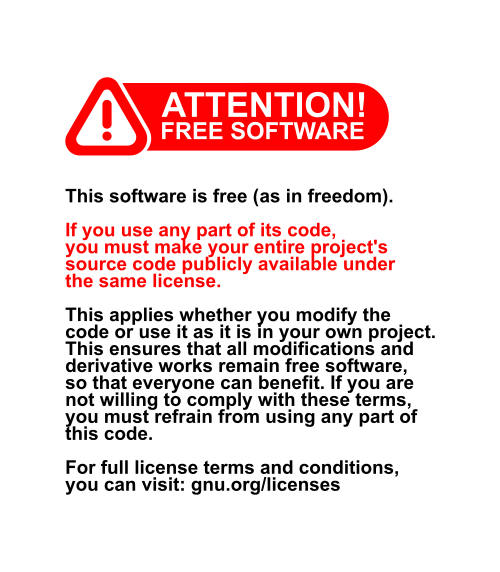
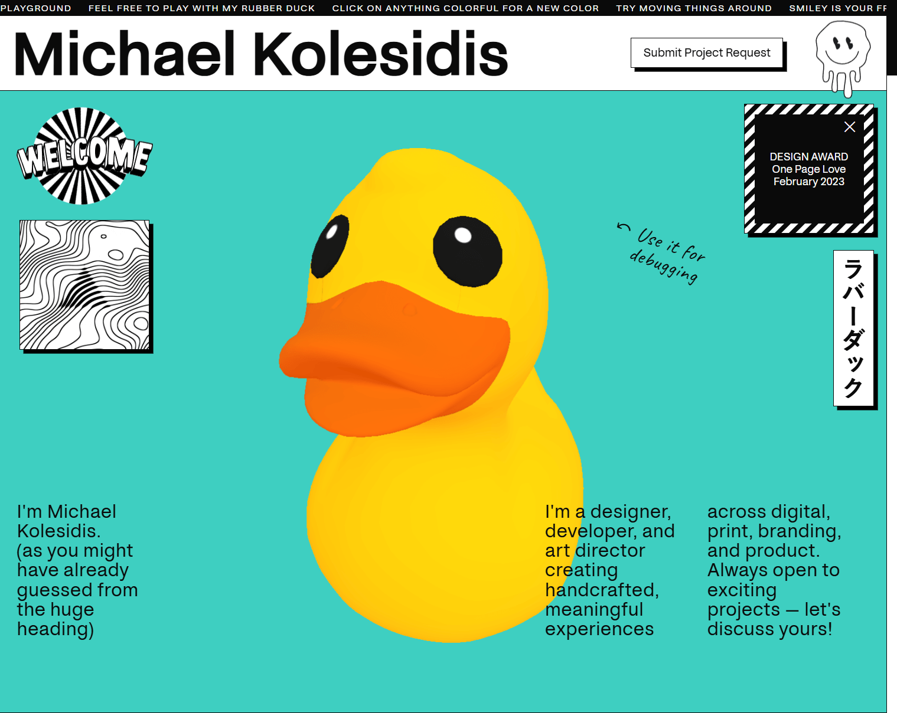
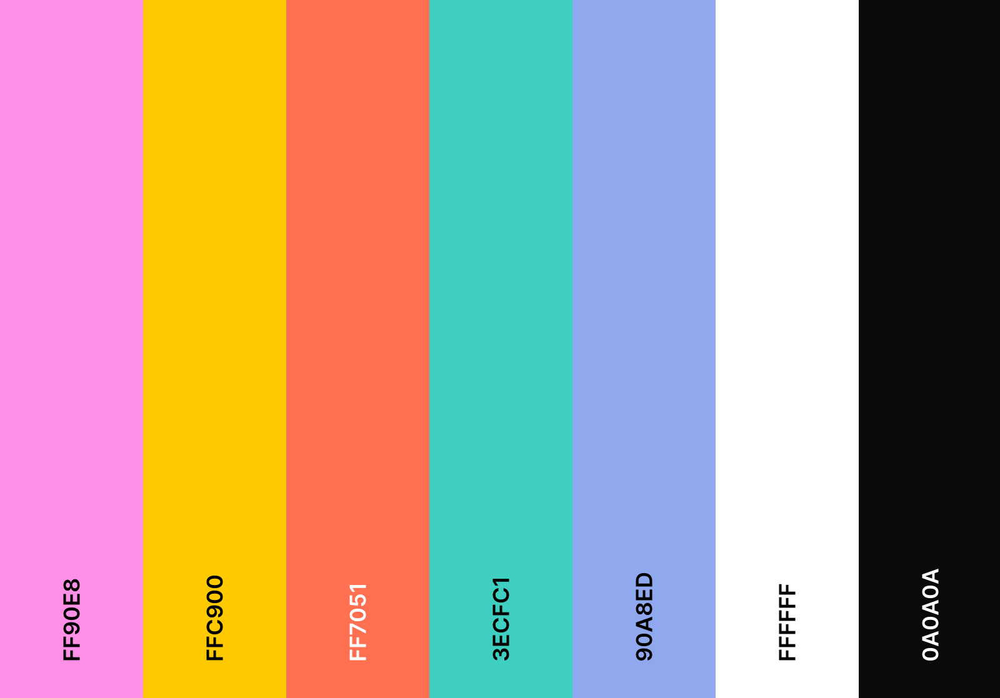
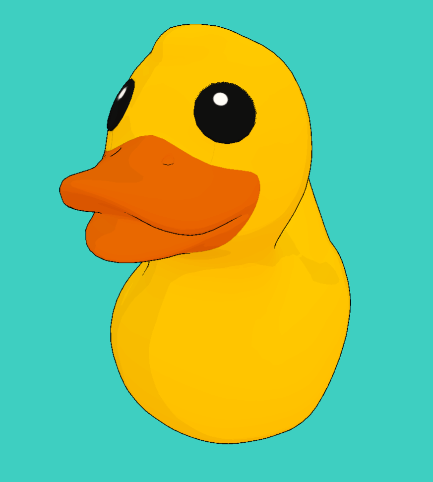
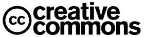

  
  
  <h4>My award-winning playground / portfolio website</h4>
  

## 🛠️ Technologies Used

&nbsp;&nbsp;&nbsp;&nbsp;&nbsp;&nbsp;

&nbsp;&nbsp;&nbsp;&nbsp;&nbsp;&nbsp;

&nbsp;&nbsp;&nbsp;&nbsp;&nbsp;&nbsp;

The website was designed handcrafted from scratch using TypeScript and Sass, with no libraries, frameworks, or templates.

### Other Technologies

I used a [WebGL](https://www.khronos.org/webgl/) shader to make TV signal noise effect, and for the 3D rubber duck I used [three.js](https://threejs.org/), a library and API to use 3D computer graphics in the browser using WebGL. I used it through [React Three Fiber](https://r3f.docs.pmnd.rs/getting-started/introduction), a React renderer for three.js.

## 💡 Concept

When did the web become so serious?  

My website is a love letter to the early Internet, a tribute to the era of naïve web art, romantic digital amateurs, and the beautiful chaos of GeoCities. I first discovered the magical world of the World Wide Web in the ’90s, and this project is my attempt to bottle some of that pixelated magic. Its visual language borrows from street art, print-era layout experimentation, and the punchy, graphic attitude of ’90s MTV.

I call the resulting aesthetic frivobrutalism: a joyful clash of whimsy and rawness, where playful visuals meet the structural honesty of brutalist design.

Visitors can interact freely, and nearly every element on the site feels intentional and alive (I hope 😛). Some elements are draggable, stacking dynamically when clicked. Colorful elements respond to interaction. Clicking them cycles through a curated palette, adding a touch of spontaneity. The rubber duck follows the mouse and switches to a cel-shaded, outlined style when clicked.

These aren’t just gimmicks. They’re carefully crafted microinteractions, where each hover, click, or drag triggers animations, sounds, or changes in state. The site becomes a playground, blurring the line between interface and artwork, inviting users to play, explore, and get lost. Just like we used to on the old web.

### Minimal Version

Due to the website’s colorful design and animations, it may be challenging for users with disabilities to navigate. To improve accessibility, I’ve also created a minimal version, available via the footer link, which points to [https://michaelkolesidis.com/minimal/](https://michaelkolesidis.com/minimal/).

## 🏆 Awards

### ★ DESIGN AWARD

**[One Page Love](https://onepagelove.com/michael-kolesidis)**

_February 2023_

Awarded by One Page Love, a One Page website design gallery showcasing the best Single Page websites, templates and resources.

### ★ STAR AWARD

**[CSS Winner](https://www.csswinner.com/details/michael-kolesidis/16936)**

_February 2023_

Awarded by CSS Winner, a unique global platform awarding and showcasing the best websites and promoting innovative web designers, developers and agencies.

### ★ SITE OF THE DAY

**[Best CSS](https://www.bestcss.in/user/detail/michaelkolesidiscom-34682)**

_March 2023_

Awarded by Best CSS, a web platform that discovers, recognizes and promotes the talent and effort of web designers, developers and agencies who create unique digital experiences that are useful, innovative, intuitive and beautiful.

## Dependencies

In addition to the tools and technologies mentioned above, this project integrates a custom npm module I created, which handles window layering (bringing windows to the front on click) and drag-and-drop functionality for window movement.

- [DOM Window Manager](https://www.npmjs.com/package/dom-window-manager) (created by me)

## 💻 Software used

### Development

- Visual Studio Code
- Google Chrome
- Blender
- Adobe Illustrator
- Adobe Photoshop
- Inkscape
- Krita
- Ableton Live
- Audacity
- GNOME Screenshot
- KDE Spectacle
- Windows Terminal
- GNOME Terminal

### Testing

- Chromium
- Mozilla Firefox
- GNOME Web
- Microsoft Edge
- Safari

## 🎨 Design

### Color Palette

| HEX     |      RGB      |
| ------- | :-----------: |
| #ff90e8 | 255, 144, 232 |
| #ffc900 |  255, 201, 0  |
| #ff7051 | 255, 112, 81  |
| #3ecfc1 | 62, 207, 193  |
| #90a8ed | 144, 168, 237 |
| #ffffff | 255, 255, 255 |
| #0a0a0a |  10, 10, 10   |

## 📸 Screenshots

The duck with cel shading and an outline.

## 🙏 Acknowledgements

A huge thanks to everyone who supported me, from friends and colleagues to anonymous internet users, providing valuable feedback throughout the development process.

## 📜 Contact

Feel free to contact me for business inquiries, feedback, bugs, comments etc.

If you use my code or my graphics in your projects, I’d love to hear about it! Feel free to email me — I'm always excited (and curious) to see how it's being used! Remember to use my code according to the terms of the respective license!

## 💖 Support the Project

Thank you for your interest in my project! If you'd like to go further and support my work, you can buy me a coffee:

## License

Copyright (c) Michael Kolesidis  
The code is licensed under the [GNU Affero General Public License v3.0](https://www.gnu.org/licenses/agpl-3.0.html).  

The graphics, the images, and the cursors, are licensed under the Creative [Commons Attribution-ShareAlike 4.0 International](https://creativecommons.org/licenses/by-sa/4.0/).
