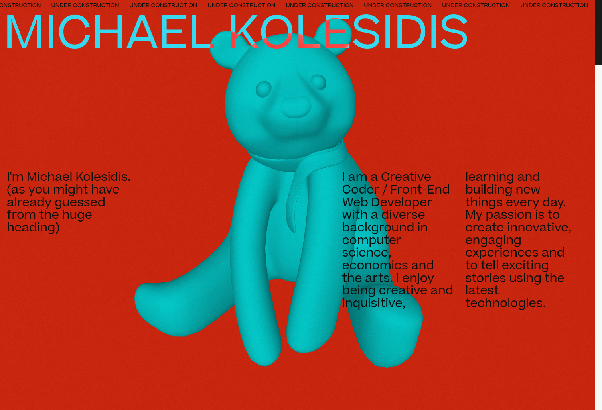
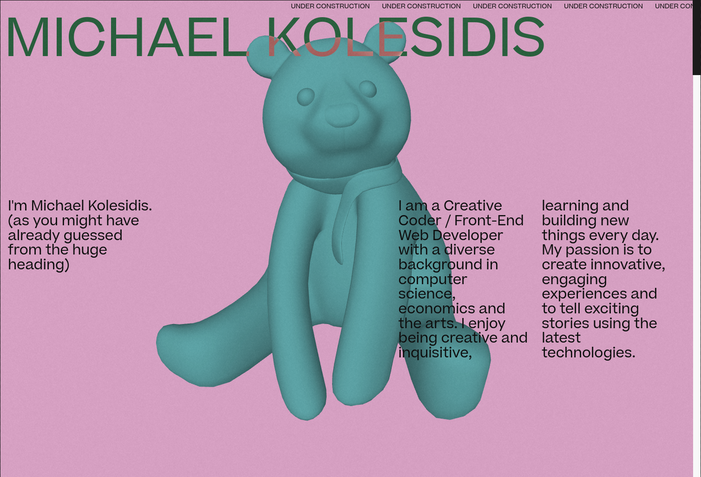
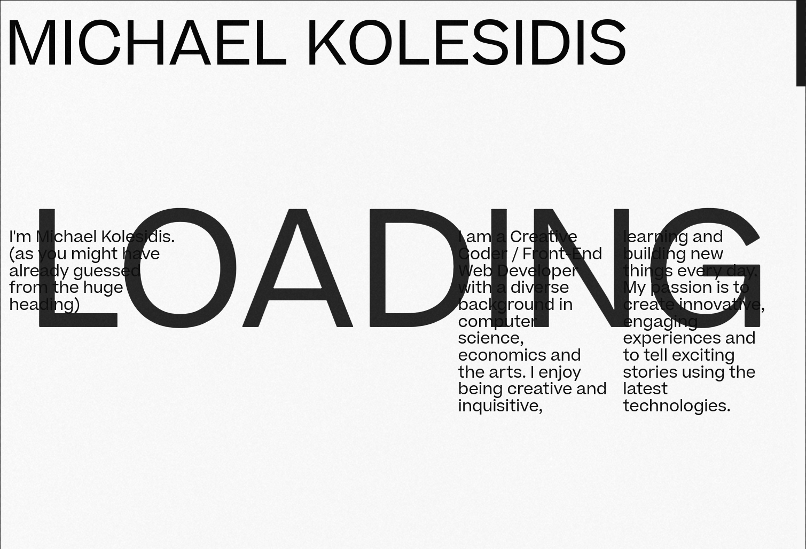

  
  <h4>This is my personal web page and it's currently under construction.</h4>

## Technologies Used

&nbsp;&nbsp;&nbsp;&nbsp;&nbsp;&nbsp;

&nbsp;&nbsp;&nbsp;&nbsp;&nbsp;&nbsp;

&nbsp;&nbsp;&nbsp;&nbsp;&nbsp;&nbsp;

&nbsp;&nbsp;&nbsp;&nbsp;&nbsp;&nbsp;

&nbsp;&nbsp;&nbsp;&nbsp;&nbsp;&nbsp;

## Concept

I aimed at a billboardesque aesthetic, with some elements of printing publication design (fashion magazine covers etc.), plus a hint of a 90's TV / 90's MTV aesthetic. I like to think of it as an interactive billboard broadcasted on an old CRT television set. It's still a work in progress and new features will be added on a regular basis.

## More Screenshots

## License

Copyright (c) 2022 Michael Kolesidis 
Licensed under the [GNU General Public License v3.0](https://www.gnu.org/licenses/gpl-3.0.html).

 
 

[//]: # (Free Software)

   
   

  

                                                       

  

