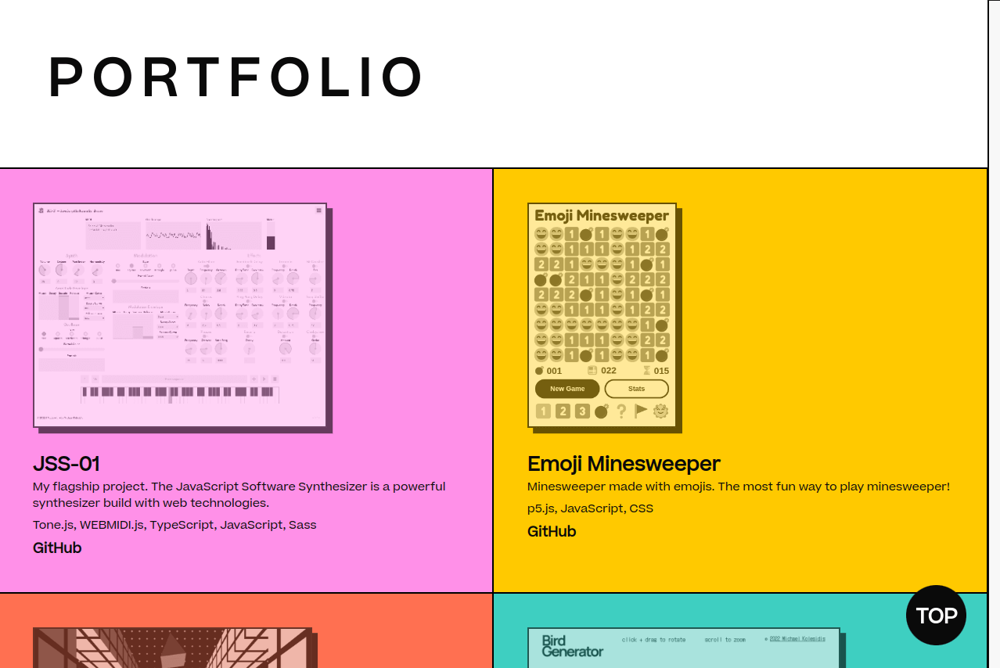
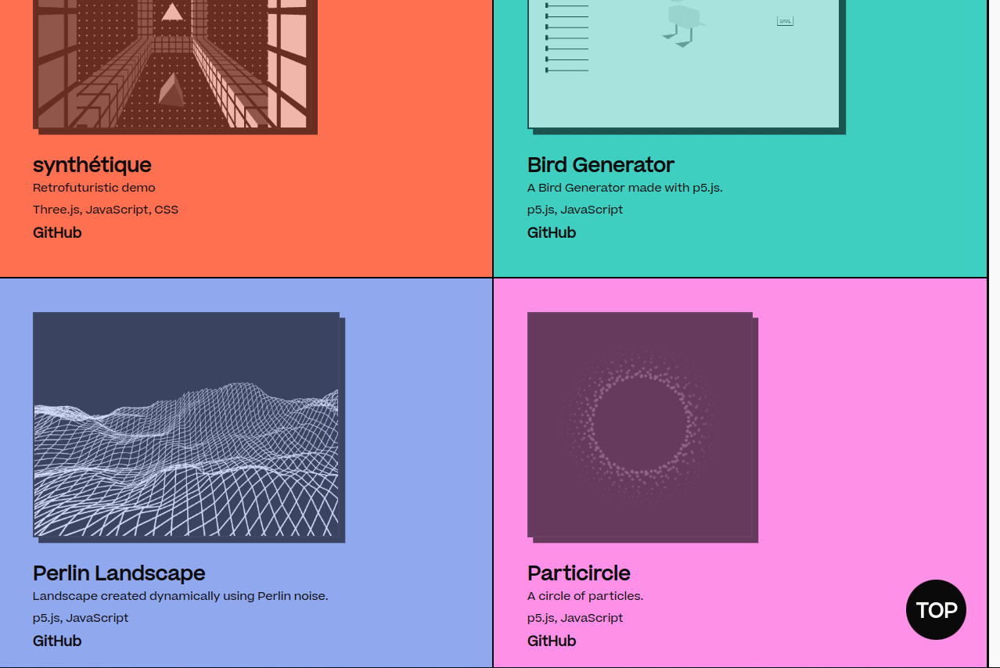
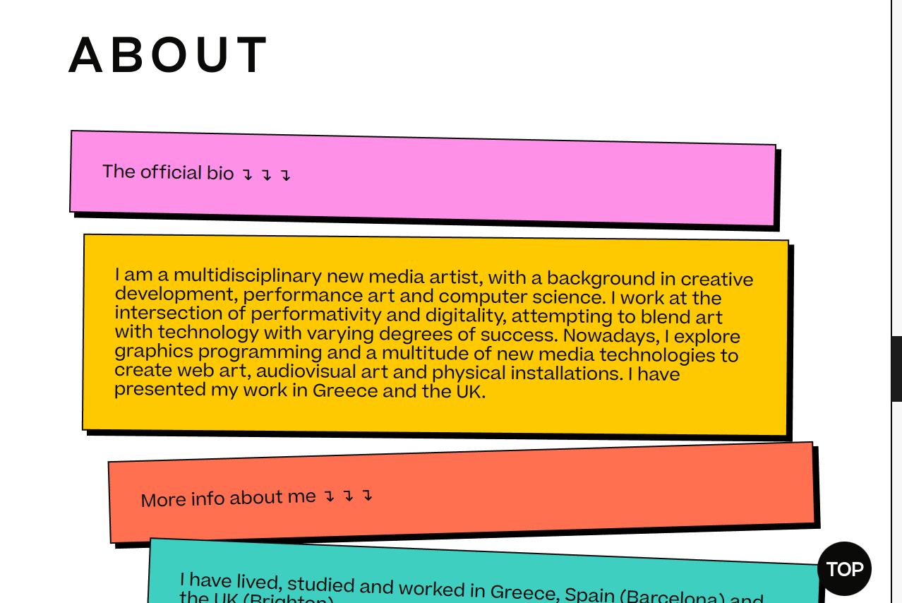
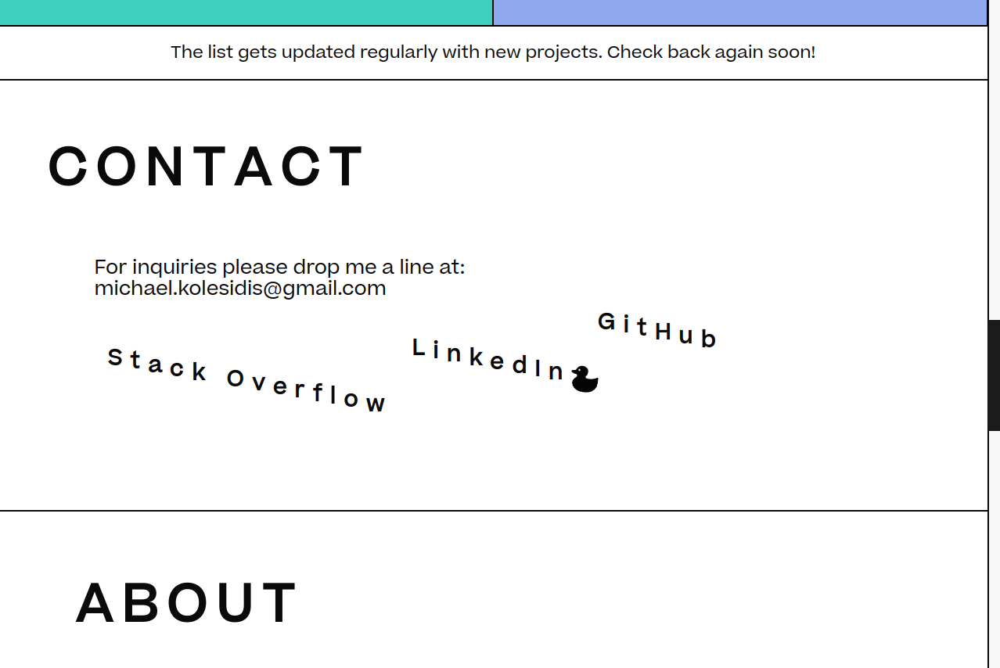
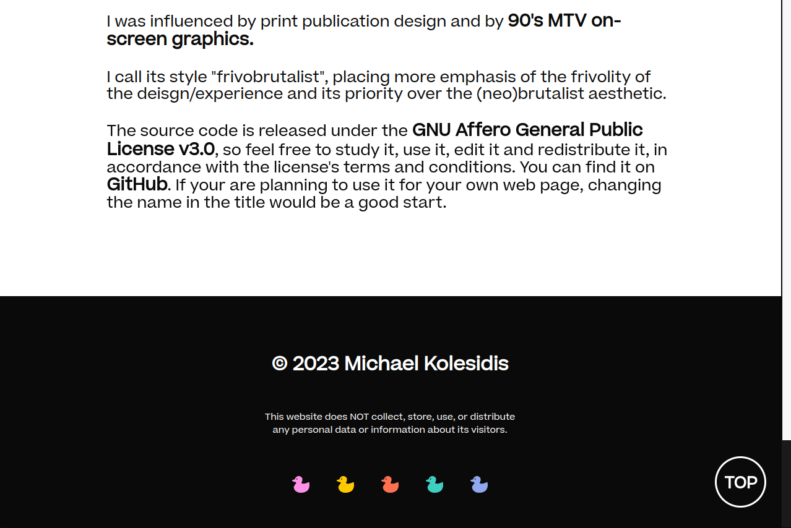
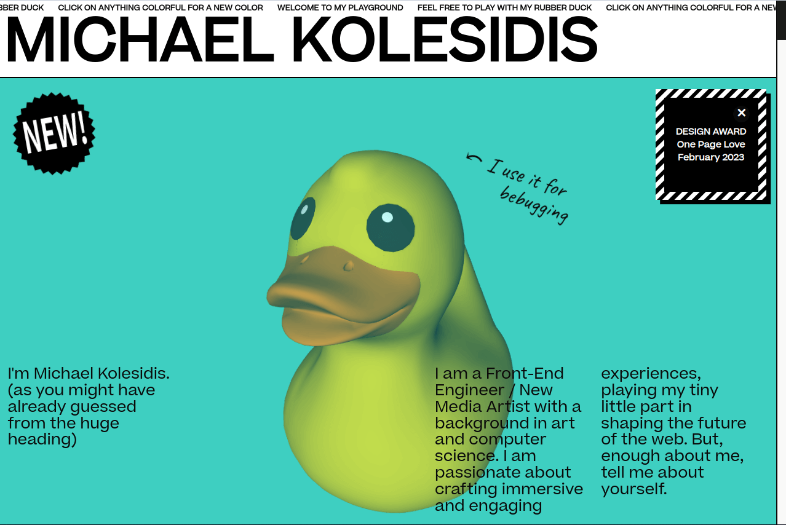
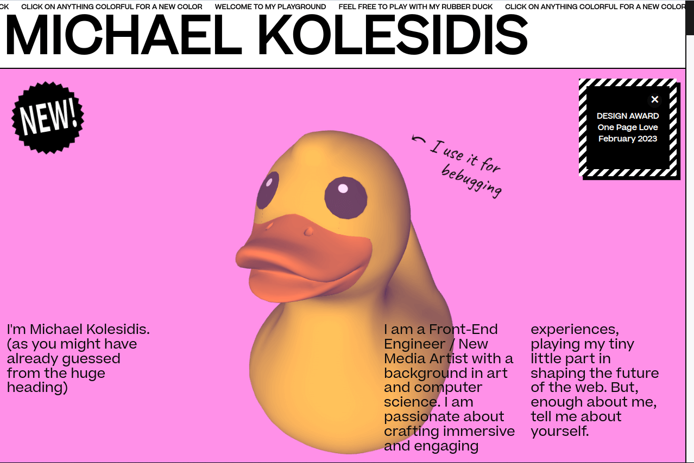
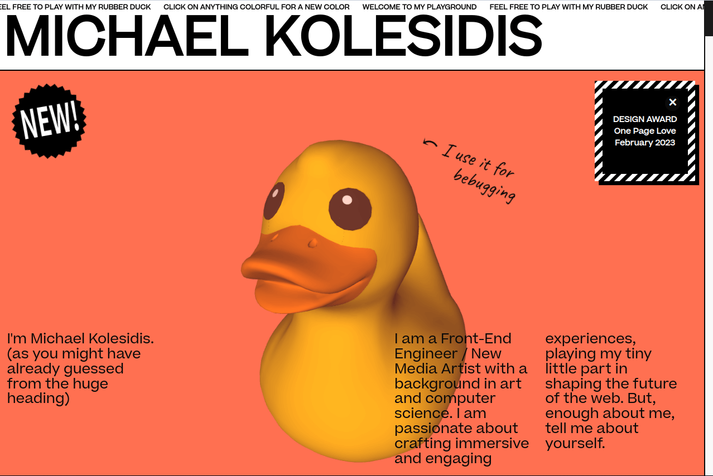
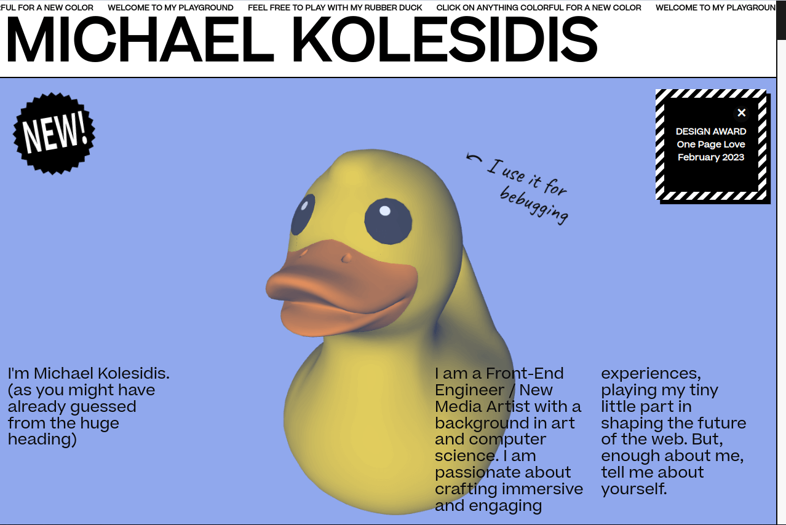

  
  <h4>My portfolio website / playground</h4>

## Technologies Used

&nbsp;&nbsp;&nbsp;&nbsp;&nbsp;&nbsp;

&nbsp;&nbsp;&nbsp;&nbsp;&nbsp;&nbsp;

&nbsp;&nbsp;&nbsp;&nbsp;&nbsp;&nbsp;

&nbsp;&nbsp;&nbsp;&nbsp;&nbsp;&nbsp;

&nbsp;&nbsp;&nbsp;&nbsp;&nbsp;&nbsp;

## Concept

This is my personal portfolio website / personal playground.

I was influenced by print publication design and by 90's MTV on-screen graphics.

The visitors can customize the colors of all colorful elements: clicking on an element generates a new color, from the predefined color palette.

The rubber duck responds to mouse move.

Most of the elements are part of microinteractions and hovering over them or interacting with them in other ways triggers some animation (and in one case it also triggers sound).

I call its style "frivobrutalism", placing emphasis of the frivolity of the deisgn/experience and its priority over the (neo)brutalist aesthetic.

## Awards

### DESIGN AWARD - Honorable One Page Website

**[One Page Love](https://onepagelove.com/michael-kolesidis)**

_February 2023_

Awarded by One Page Love, a One Page website design gallery showcasing the best Single Page websites, templates and resources.

## Screenshots

## License

Copyright (c) 2023 Michael Kolesidis 
Licensed under the [GNU Affero General Public License v3.0](https://www.gnu.org/licenses/agpl-3.0.html).
