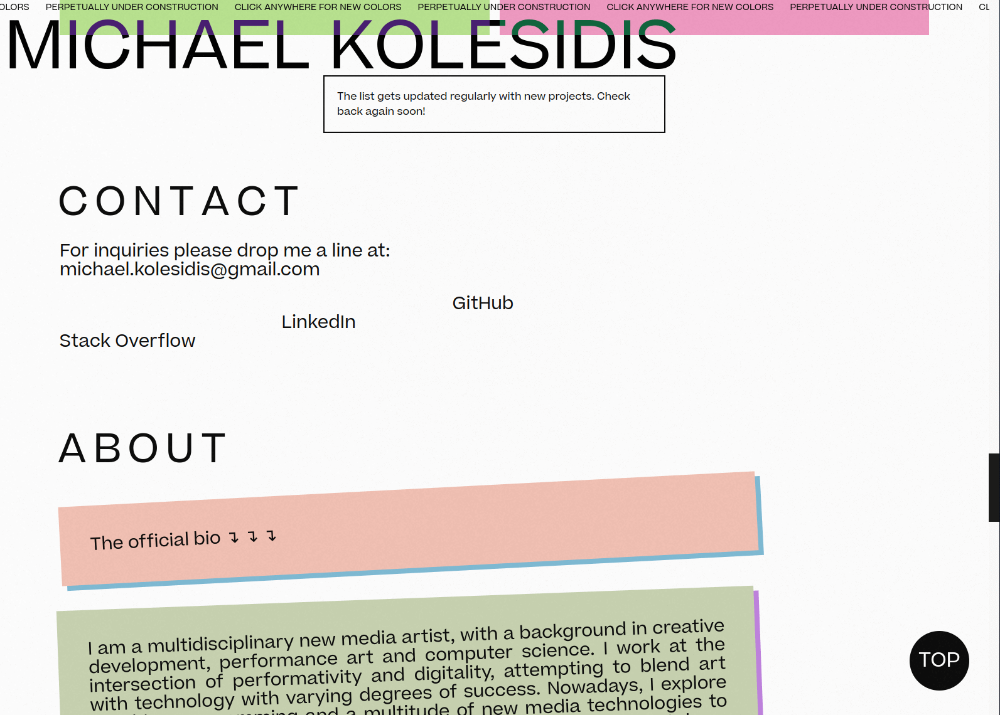
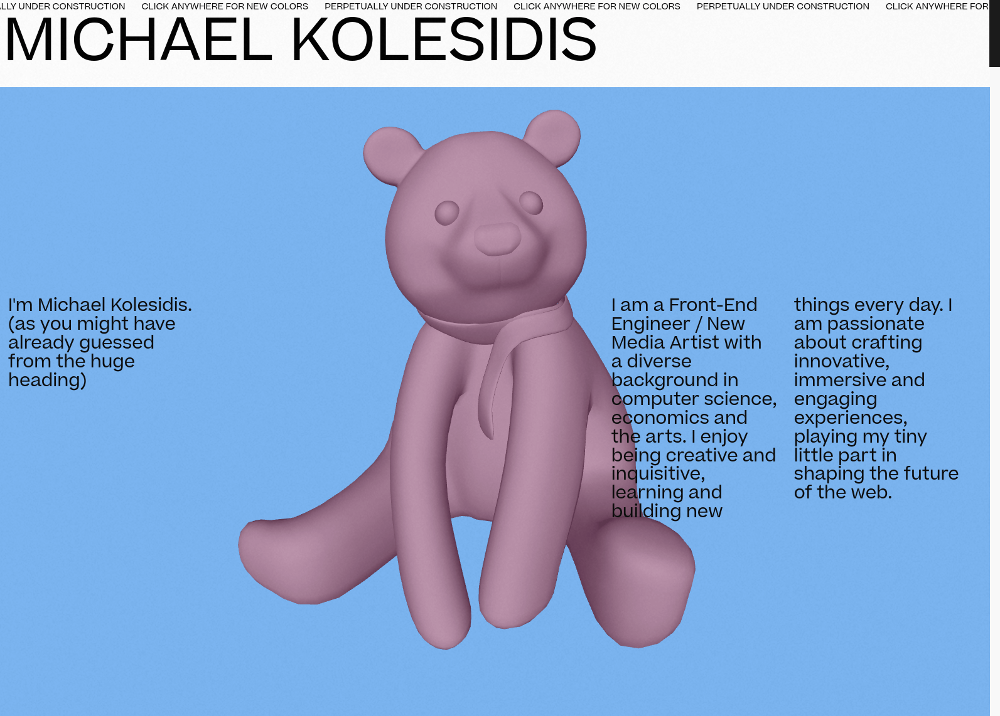
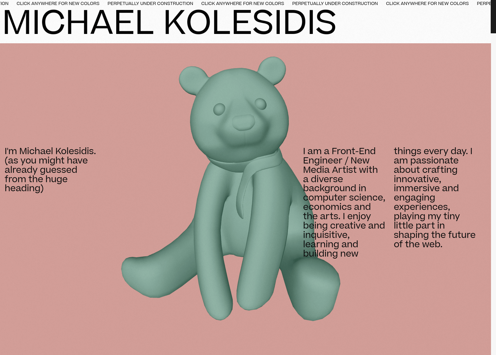
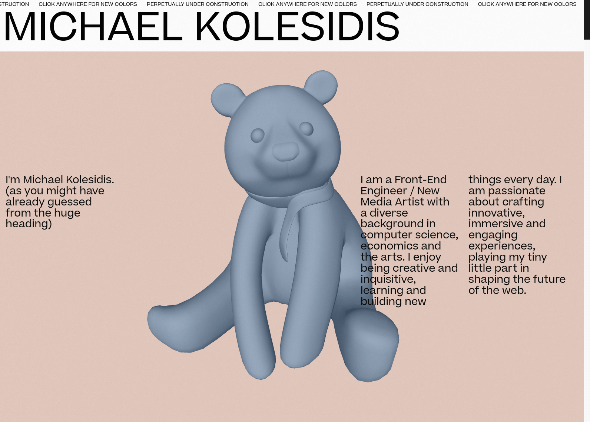

  
  <h4>This is my personal web page and it's perpetually under construction.</h4>

## Technologies Used

&nbsp;&nbsp;&nbsp;&nbsp;&nbsp;&nbsp;

&nbsp;&nbsp;&nbsp;&nbsp;&nbsp;&nbsp;

&nbsp;&nbsp;&nbsp;&nbsp;&nbsp;&nbsp;

&nbsp;&nbsp;&nbsp;&nbsp;&nbsp;&nbsp;

&nbsp;&nbsp;&nbsp;&nbsp;&nbsp;&nbsp;

## Concept

I went for a billboardesque aesthetic, with some elements of printing publication design (fashion magazine covers etc.), plus a hint of a 90's TV / 90's MTV aesthetic. I like to think of it as an interactive billboard broadcasted on an old CRT television set.

The colors (and the angles on some elements) are generated randomly when the website is visited, chosen from a predefined palette/range.

The visitors can customize the colors of all colored elements: clicking on an element generates a new color, from the same predefined palette/range.

Most of the elements are part of microinteractions and hovering over them or interacting with them in other ways triggers some animation. Make sure to explore all of them :-)

## Awards

### DESIGN AWARD - Honorable One Page Website

**[One Page Love](https://onepagelove.com/michael-kolesidis)**

_February 2023_

Awarded by One Page Love, a One Page website design gallery showcasing the best Single Page websites, templates and resources.

## Screenshots

### v. 2.0

Coming soon

### v. 1.0

## License

Copyright (c) 2023 Michael Kolesidis 
Licensed under the [GNU Affero General Public License v3.0](https://www.gnu.org/licenses/agpl-3.0.html).
