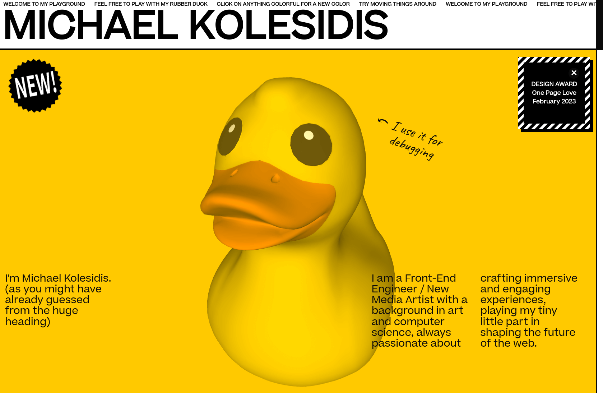
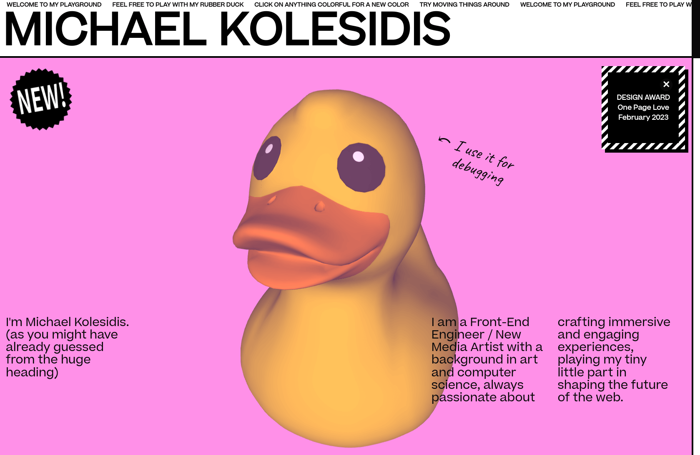
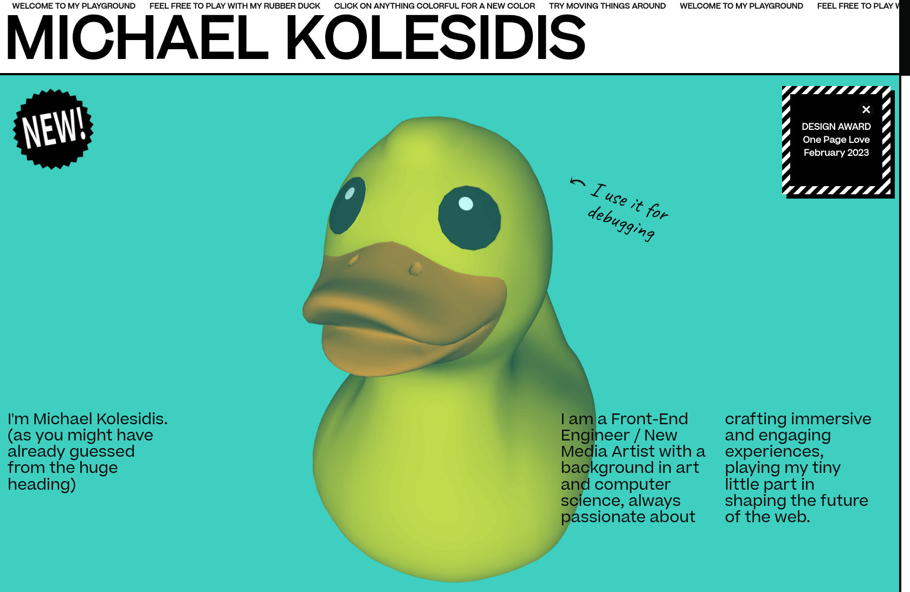
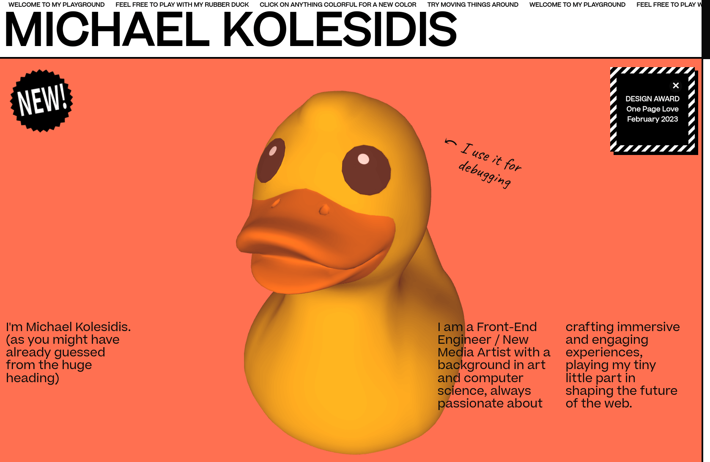

  
  <h4>My portfolio website / playground</h4>

## Technologies Used

&nbsp;&nbsp;&nbsp;&nbsp;&nbsp;&nbsp;

&nbsp;&nbsp;&nbsp;&nbsp;&nbsp;&nbsp;

&nbsp;&nbsp;&nbsp;&nbsp;&nbsp;&nbsp;

&nbsp;&nbsp;&nbsp;&nbsp;&nbsp;&nbsp;

&nbsp;&nbsp;&nbsp;&nbsp;&nbsp;&nbsp;

## Concept

This is my personal portfolio website / personal playground.

It is a love letter to the internet of the old, the era of the naïve (web) art, the era of the romantic amateur, the era of Geocities. I first experienced the magical world of the world wide web in the 90's and I hope I managed to capture a glimpse of that time. I was also influenced by print publication design and by 90's MTV on-screen graphics.

I call this style **frivobrutalism**, placing emphasis on the blend of the playfulness frivolity of the deisgn/experience with the brutalist aesthetic.

Visitors can move thins around and customize the colors of all colorful elements: clicking on an element generates a new color, from the predefined color palette. The rubber duck responds to mouse move.

Most of the elements are part of microinteractions and hovering over them or interacting with them in other ways triggers some animation (and in one case it also triggers sound).

The website is responsive for desktop and mobile.

### Minimal Version

Since the website is quite colorful and full of animations, it might be difficult for people with disabilities to navigate through it. That's why I decided to create a minimal version as well, to assist people with color blindness and/or other disabilities with their experience. The minimal version can be accessed from the website's footer, which points to [https://michaelkolesidis.com/minimal/](https://michaelkolesidis.com/minimal/).

## Awards

### ★ DESIGN AWARD

**[One Page Love](https://onepagelove.com/michael-kolesidis)**

_February 2023_

Awarded by One Page Love, a One Page website design gallery showcasing the best Single Page websites, templates and resources.

### ★ STAR AWARD

**[CSS Winner](https://www.csswinner.com/details/michael-kolesidis/16936)**

_February 2023_

Awarded by CSS Winner, a unique global platform awarding and showcasing the best websites and promoting innovative web designers, developers and agencies.

## Dependencies

The project uses the following npm packages:

- [Vite](https://www.npmjs.com/package/vite)
- [TypeScript](https://www.npmjs.com/package/typescript)
- [Sass](https://www.npmjs.com/package/sass)
- [DOM Window Manager](https://www.npmjs.com/package/dom-window-manager) (created by me)

This library is imported using CDN:

- [p5.js](https://cdnjs.com/libraries/p5.js)

## Software used

- Visual Studio Code
- Google Chrome
- Chromium
- Mozilla Firefox
- GNOME Web
- Microsoft Edge
- Blender
- Inkscape
- Krita
- Audacity
- GNOME Screenshot
- KDE Spectacle
- GNOME Terminal

## Design

### Color Palette

| HEX     |      RGB      |
| ------- | :-----------: |
| #ff90e8 | 255, 144, 232 |
| #ffc900 |  255, 201, 0  |
| #ff7051 | 255, 112, 81  |
| #3ecfc1 | 62, 207, 193  |
| #90a8ed | 144, 168, 237 |
| #ffffff | 255, 255, 255 |
| #0a0a0a |  10, 10, 10   |

## Screenshots

### Desktop

### Mobile

### Minimal Version

### Full Page

- [Desktop](./screenshots/desktop_fullpage.png)
- [Mobile](./screenshots/mobile_fullpage.png)

## Acknowledgements

A huge thanks to everyone (from friends and colleagues to the anonymous people of the internet) who supported me and provided me with valuable feedback throught the development process.

## License

Copyright (c) 2023 Michael Kolesidis 
Licensed under the [GNU Affero General Public License v3.0](https://www.gnu.org/licenses/agpl-3.0.html).
